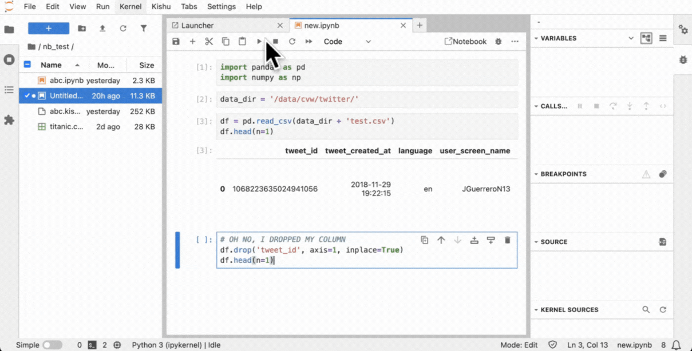

[](htps://github.com/illinoisdata/kishu)
[](https://codecov.io/gh/illinoisdata/kishu)
[](https://pypi.org/project/kishu/)
[](https://pypi.org/project/kishu/)
<!---
[](htps://github.com/illinoisdata/kishu)
[](htps://github.com/illinoisdata/kishu)
--->

# Kishu: Versioned and Undoable Notebook System

<br>
<div align="center">

</div>
<br>

Kishu is a system for intelligent versioning of notebook session states on Jupyter-based platforms (e.g. JupyterLab, Jupyter Hub). Kishu efficiently creates checkpoints of both the variable and code states of a notebook session, allowing users to both undo cell executions and manage branching states containing objects such as machine learning models, plots, and dataframes through a Git-like commit and checkout interface.

## Getting Started

Kishu can be installed from [PyPI](https://pypi.org/project/kishu/):

```bash
pip install kishu jupyterlab_kishu
```

Note: installing `jupyterlab_kishu` will also install `jupyterlab` into your environment.

## Using Kishu

Once Kishu has been installed, an additional `Kishu` tab should appear in JupyterLab's toolbar. This tab will allow access to Kishu's various functionalities:

<br>
<div align="center">

</div>
<br>

### Step 1: Initializing Kishu on a Notebook
To start protecting your notebook session, Kishu can be initialized and attached through the `Kishu > Initialize/Re-attach` option under the `Kishu` tab. Alternatively, you can use the shortcut `Ctrl+K then Ctrl+I` / `⌘+K then ⌘+I`:

<br>
<div align="center">

</div>
<br>

### Step 2: Run Cells as Normal

Once initialized, you can proceed to execute cells in the session as normal. Kishu will automatically and transparently checkpoint your variable state (imported libraries, loaded dataframes, drawn plots, fitted models, etc.) after each cell execution.

<br>
<div align="center">

</div>
<br>

## Undoing cell executions

To undo your latest cell execution, you can use the `Kishu > Undo Execution` option under the `Kishu` tab:

<br>
<div align="center">

</div>
<br>

Undoing cell executions **only affects the variable state**. The code state (i.e., the cells you write) is untouched. This can be useful, for example, to 'un-drop' a dataframe column dropped by a cell while keeping the cell code itself intact.

## Checkpointing and Checking out Notebook States

Kishu can also be used to manage branching code and variable states; it supports making **checkpoints** of the notebook and variable state at any point during a notebook session, which can be returned to later via a **checkout**.

### Step 1: Committing to make a checkpoint
Kishu can store the current state of your notebook, including both the variable state and your code state, with the `Kishu > Commit` option under the `Kishu` tab. Alternatively, you can use the shortcut `Ctrl+K then Ctrl+C` / `⌘+K then ⌘+C`. You will be prompted to enter a **commit message**:

<br>
<div align="center">

</div>
<br>

### Step 2: Checkout to a checkpoint
You can return to a commit with the `Kishu > Checkout` option under the `Kishu` tab. Alternatively, you can use the shortcut `Ctrl+K then Ctrl+V` / `⌘+K then ⌘+V`. This will bring up a menu for you to select the appropriate commit:

<br>
<div align="center">

</div>
<br>

Checking out will replace both the current variable and code state with that of the selected checkpoint. It will also **overwrite your current variable and code state**; commit to make a (second) checkpoint before checking out if you wish to keep your current notebook state.

## Configuring Kishu

Kishu can be configured through editing the `~/.kishu/config.ini` file. A full list of configurable options can be found [here](docs/src/usage.rst).

## Kishuboard
Kishuboard is a graphical interface for visualizing Kishu commit history as a graph, similar to Git GUI tools like Sublime Merge. It enables one-click operations such as diff, search, checkout, and undo (rollback) to a specific commit. For a full list of supported features, see the [documentation](to be filled).

To install Kishuboard, run:
```bash
pip install kishuboard
```

And then, launch it with:
```bash
kishuboard
```

When Kishu is attached to a new notebook, **refresh** the notebook list. To enter the GUI of a specific notebook, simply click on its entry in the list.


## Supported Libraries

This is the current list of libraries, their versions, and their classes supported by Kishu:
```
- ✅ : supported: All changes to instances of this class are always captured.
- 🟨 : too conservative: Kishu may report changes on non-changes to instances of this class, i.e., false positives.
- ❌ : failing: Some changes to an instance of this class may not be captured.

    ✅ arrow==1.3.0, arrow.arrow.Arrow
    ✅ astropy==5.2.2, astropy.convolution.Box2DKernel
    ✅ astropy==5.2.2, astropy.convolution.Gaussian2DKernel
    ✅ astropy==5.2.2, astropy.io.fits.HDUList
    ✅ astropy==5.2.2, astropy.io.fits.PrimaryHDU
    ✅ astropy==5.2.2, astropy.modeling.fitting.LinearLSQFitter
    ✅ astropy==5.2.2, astropy.modeling.functional_models.Ellipse2D
    ✅ astropy==5.2.2, astropy.modeling.functional_models.Linear1D
    ✅ astropy==5.2.2, astropy.modeling.polynomial.Polynomial1D
    ✅ astropy==5.2.2, astropy.modeling.polynomial.Polynomial2D
    ✅ astropy==5.2.2, astropy.nddata.NDData
    ✅ astropy==5.2.2, astropy.nddata.NDDataRef
    ✅ astropy==5.2.2, astropy.stats.SigmaClip
    ✅ astropy==5.2.2, astropy.table.QTable
    ✅ astropy==5.2.2, astropy.units.Quantity
    ✅ astropy==5.2.2, astropy.visualization.PercentileInterval
    ✅ astropy==5.2.2, astropy.wcs.WCS
    ✅ bokeh==2.4.3, bokeh.plotting._figure.figure
    ✅ catboost==1.2.3, catboost
    ✅ dask==2023.5.0, dask
    ✅ dataprep==0.4.5, dataprep.datasets
    ✅ dataprep==0.4.5, dataprep.eda.intermediate.Intermediate
    ✅ dill==0.3.8, dill
    ✅ gensim==4.3.2, gensim
    ✅ gym==0.26.2, gym
    ✅ ipywidgets==7.8.5, ipywidgets
    ✅ keras==2.13.1, keras.src.initializers.initializers.RandomNormal
    ✅ keras==2.13.1, keras.src.initializers.initializers.RandomUniform
    ✅ keras==2.13.1, keras.src.layers.core.dense.Dense
    ✅ keras==2.13.1, keras.src.optimizers.schedules.learning_rate_schedule.ExponentialDecay
    ✅ lightgbm==4.3.0, lightgbm.basic.Dataset
    ✅ llm==0.13.1, llm.default_plugins.openai_models.Chat
    ✅ lmfit==1.2.2, lmfit.parameter.Parameters
    ✅ matplotlib==3.7.5, matplotlib.colors.ListedColormap
    ✅ matplotlib==3.7.5, matplotlib.dates.AutoDateFormatter
    ✅ matplotlib==3.7.5, matplotlib.dates.WeekdayLocator
    ✅ matplotlib==3.7.5, matplotlib.ticker.AutoLocator
    ✅ networkx==3.1, networkx.classes.digraph.DiGraph
    ✅ networkx==3.1, networkx.classes.graph.Graph
    ✅ nltk==3.8.1, nltk.stem.porter.PorterStemmer
    ✅ numpy==1.24.3, ast
    ✅ numpy==1.24.3, copy
    ✅ numpy==1.24.3, datetime.time
    ✅ numpy==1.24.3, datetime.timedelta
    ✅ numpy==1.24.3, hashlib
    ✅ numpy==1.24.3, itertools
    ✅ numpy==1.24.3, json
    ✅ numpy==1.24.3, numpy.ndarray
    ✅ numpy==1.24.3, numpy.ndarray
    ✅ numpy==1.24.3, pickle
    ✅ numpy==1.24.3, random.Random
    ✅ numpy==1.24.3, re.Pattern
    ✅ numpy==1.24.3, urllib.request.Request
    ✅ numpy==1.24.3, uuid.UUID
    ✅ opencv-python==4.9.0.80, cv2
    ✅ optuna==3.5.0, optuna.Study
    ✅ pandas==1.5.3, pandas.DataFrame
    ✅ pandas==1.5.3, pandas.Series
    ✅ pathlib==1.0.1, pathlib.PosixPath
    ✅ photoutils==0.0.1, photutils.psf.matching.CosineBellWindow
    ✅ photoutils==0.0.1, photutils.psf.matching.HanningWindow
    ✅ photoutils==0.0.1, photutils.utils.CutoutImage
    ✅ photoutils==0.0.1, photutils.utils.ImageDepth
    ✅ plotly==5.18.0, plotly.express
    ✅ plotly==5.18.0, plotly.figure_factory
    ✅ plotly==5.18.0, plotly.graph_objects
    ✅ plotly==5.18.0, plotly.graph_objs
    ✅ plotly==5.18.0, plotly.io
    ✅ plotly==5.18.0, plotly.offline
    ✅ plotly==5.18.0, plotly.subplots
    ✅ polars==0.14.29, polars.DataFrame
    ✅ prophet==1.1.5, prophet.Prophet
    ✅ pyspark==3.5.1, pyspark.sql
    ✅ qiskit==0.45.0, qiskit.QuantumCircuit
    ✅ scikit-image==0.21.0, skimage
    ✅ scikit-image==0.21.0, skimage.morphology
    ✅ scikit-learn==1.3.2, sklearn.cluster
    ✅ scikit-learn==1.3.2, sklearn.cluster
    ✅ scikit-learn==1.3.2, sklearn.compose
    ✅ scikit-learn==1.3.2, sklearn.datasets
    ✅ scikit-learn==1.3.2, sklearn.datasets
    ✅ scikit-learn==1.3.2, sklearn.decomposition
    ✅ scikit-learn==1.3.2, sklearn.discriminant_analysis
    ✅ scikit-learn==1.3.2, sklearn.dummy
    ✅ scikit-learn==1.3.2, sklearn.ensemble
    ✅ scikit-learn==1.3.2, sklearn.feature_extraction.text
    ✅ scikit-learn==1.3.2, sklearn.feature_selection
    ✅ scikit-learn==1.3.2, sklearn.impute
    ✅ scikit-learn==1.3.2, sklearn.impute
    ✅ scikit-learn==1.3.2, sklearn.impute
    ✅ scikit-learn==1.3.2, sklearn.kernel_ridge
    ✅ scikit-learn==1.3.2, sklearn.linear_model
    ✅ scikit-learn==1.3.2, sklearn.linear_model
    ✅ scikit-learn==1.3.2, sklearn.manifold
    ✅ scikit-learn==1.3.2, sklearn.metrics
    ✅ scikit-learn==1.3.2, sklearn.metrics.pairwise
    ✅ scikit-learn==1.3.2, sklearn.mixture
    ✅ scikit-learn==1.3.2, sklearn.model_selection
    ✅ scikit-learn==1.3.2, sklearn.multiclass
    ✅ scikit-learn==1.3.2, sklearn.naive_bayes
    ✅ scikit-learn==1.3.2, sklearn.neighbors
    ✅ scikit-learn==1.3.2, sklearn.neural_network
    ✅ scikit-learn==1.3.2, sklearn.pipeline
    ✅ scikit-learn==1.3.2, sklearn.preprocessing
    ✅ scikit-learn==1.3.2, sklearn.random_projection
    ✅ scikit-learn==1.3.2, sklearn.svm
    ✅ scikit-learn==1.3.2, sklearn.tree
    ✅ scikit-learn==1.3.2, sklearn.utils
    ✅ scipy==1.10.1, scipy.interpolate
    ✅ scipy==1.10.1, scipy.ndimage
    ✅ scipy==1.10.1, scipy.ndimage.interpolate
    ✅ scipy==1.10.1, scipy.optimize
    ✅ scipy==1.10.1, scipy.signal
    ✅ scipy==1.10.1, scipy.signal.windows
    ✅ scipy==1.10.1, scipy.sparse
    ✅ scipy==1.10.1, scipy.spatial
    ✅ scipy==1.10.1, scipy.spatial
    ✅ scipy==1.10.1, scipy.spatial.distance
    ✅ scipy==1.10.1, scipy.spatial.distance._hausdorff
    ✅ scipy==1.10.1, scipy.special
    ✅ scipy==1.10.1, scipy.stats
    ✅ statsmodels==0.14.1, statsmodels.api
    ✅ tensorflow==2.13.1, tensorflow
    ✅ tensorflow==2.13.1, tensorflow.keras.models
    ✅ tensorflow==2.13.1, tensorflow.keras.optimizers
    ✅ textblob==0.17.1, textblob.TextBlob
    ✅ torch==2.4.1, torch
    ✅ torch==2.4.1, torch.nn
    ✅ torch==2.4.1, torch.nn.functional
    ✅ torch==2.4.1, torch.utils.data
    ✅ transformers==4.38.2, huggingface
    ✅ transformers==4.38.2, transformers
    ✅ typing==3.7.4.3, typing
    ✅ wordcloud==1.9.3, wordcloud.WordCloud
    🟨 matplotlib==3.7.5, matplotlib.Axes
    🟨 matplotlib==3.7.5, matplotlib.Axes
    🟨 seaborn==0.13.0, seaborn
    🟨 torch==2.4.1, torch.optim
    🟨 polars==0.14.29, polars.LazyFrame
    🟨 matplotlib==3.7.5, matplotlib.colors.BoundaryNorm
    🟨 matplotlib==3.7.5, matplotlib.lines.Line2D
    🟨 matplotlib==3.7.5, matplotlib.patches.Ellipse
    🟨 matplotlib==3.7.5, matplotlib.patches.Arrow
    🟨 matplotlib==3.7.5, matplotlib.image.AxesImage
    🟨 matplotlib==3.7.5, matplotlib.image.FigureImage
    🟨 matplotlib==3.7.5, matplotlib.offsetbox.AnchoredOffsetbox
    🟨 astropy==5.2.2, astropy.visualization.mpl_normalize.ImageNormalize
    🟨 astropy==5.2.2, astropy.wcs.Celprm
    🟨 matplotlib==3.7.5, 'mpl_toolkits.mplot3d.art3d.Line3DCollection
```

## Limitations
Kishu may fail to correctly checkpoint notebook sessions containing the following items:

### Silent Pickling Errors

Kishu relies on the assumption that any object, when pickled then unpickled, is identical to the original object, and does not automatically detect cases where this assumption is violated (i.e., silent pickling errors). This is typically caused by errors in the object class' [__reduce__](https://docs.python.org/3/library/pickle.html) function which acts as its pickling instructions; for example, an object with the below reduction (incorrectly) returns an empty (byte)string when pickled.

```python
  def __reduce__(self):
      return ""
```

As a potential workaround, you can add object classes with incorrect reductions to a [blocklist](docs/src/usage.rst) in Kishu's config to inform it to never try to store (and always recompute) objects belonging to these classes.

### Non-Deterministic and Unpicklable Objects
Kishu relies on cell replay to reconstruct unpicklable objects (e.g., generators). However, if the unpicklable object itself is created through non-deterministic means, Kishu will fail to exactly recreate it on undo/checkout, for example (assuming the seed for `random` was not set):

```python
  nondet_gen = (i for i in range(random.randint(5, 10)))
```

## FAQ

**Q1:** I am getting a `Kernel for the notebook not found` error when initializing Kishu on a new notebook file. What is going on?

<br>
<div align="center">

</div>
<br>

**A1:** This happens if there is no running kernel for the current notebook file. Click the `Kernel` icon to start a new notebook kernel, then proceed with initializing Kishu normally.

<br>
<div align="center">

</div>
<br>

## Learn More

Kishu's efficiency is enabled by its low-overhead session state monitoring, deduplicated variable storage, and optimized recomputation-assisted checkout. Our papers on Kishu can be found here; don't forget to star our repository and cite our papers if you like our work!

- [Kishu: Time-Traveling for Computational Notebooks](https://arxiv.org/abs/2406.13856)
- [Enhancing Computational Notebooks with Code+Data Space Versioning](https://arxiv.org/abs/2504.01367)
- [ElasticNotebook: Enabling Live Migration for Computational Notebooks](https://dl.acm.org/doi/abs/10.14778/3626292.3626296)
- [Large-scale Evaluation of Notebook Checkpointing with AI Agents](https://arxiv.org/abs/2504.01377)
- [Transactional Python for Durable Machine Learning: Vision, Challenges, and Feasibility](https://dl.acm.org/doi/abs/10.1145/3595360.3595855)
- [Demonstration of ElasticNotebook: Migrating Live Computational Notebook States](https://dl.acm.org/doi/abs/10.1145/3626246.3654752)

```
@article{li2024kishu,
  title={Kishu: Time-Traveling for Computational Notebooks},
  author={Li, Zhaoheng and Chockchowwat, Supawit and Sahu, Ribhav and Sheth, Areet and Park, Yongjoo},
  journal={Proceedings of the VLDB Endowment},
  volume={18},
  number={4},
  pages={970 - 985},
  year={2024},
  doi={10.14778/3717755.3717759},
  publisher={VLDB Endowment},
}

@inproceedings{fang2025enhancing,
  title={Enhancing Computational Notebooks with Code+Data Space Versioning},
  author={Fang, Hanxi and Chockchowwat, Supawit and Sundaram, Hari and Park, Yongjoo},
  booktitle={CHI Conference on Human Factors in Computing Systems (Chi '25)},
  year={2025},
  doi={doi.org/10.1145/3706598.3714141}
}

@article{li2023elasticnotebook,
  title={ElasticNotebook: Enabling Live Migration for Computational Notebooks},
  author={Li, Zhaoheng and Gor, Pranav and Prabhu, Rahul and Yu, Hui and Mao, Yuzhou and Park, Yongjoo},
  journal={Proceedings of the VLDB Endowment},
  volume={17},
  number={2},
  pages={119--133},
  year={2023},
  doi={10.14778/3626292.3626296},
  publisher={VLDB Endowment}
}

@inproceedings{fang2025large,
  title={Large-scale Evaluation of Notebook Checkpointing with AI Agents},
  author={Fang, Hanxi and Chockchowwat, Supawit and Sundaram, Hari and Park, Yongjoo},
  booktitle={Late-breaking work in CHI Conference on Human Factors in Computing Systems (Chi '25)},
  year={2025}
}

@inproceedings{chockchowwat2023transactional,
  title={Transactional python for durable machine learning: Vision, challenges, and feasibility},
  author={Chockchowwat, Supawit and Li, Zhaoheng and Park, Yongjoo},
  booktitle={Proceedings of the Seventh Workshop on Data Management for End-to-End Machine Learning},
  pages={1--5},
  year={2023},
  doi={10.1145/3595360.3595855}
}

@inproceedings{li2024demonstration,
  title={Demonstration of ElasticNotebook: Migrating Live Computational Notebook States},
  author={Li, Zhaoheng and Chockchowwat, Supawit and Fang, Hanxi and Sahu, Ribhav and Thakurdesai, Sumay and Pridaphatrakun, Kantanat and Park, Yongjoo},
  booktitle={Companion of the 2024 International Conference on Management of Data},
  pages={540--543},
  year={2024},
  doi={10.1145/3626246.3654752}
}
```

## Contributing

To get started with developing Kishu, see [CONTRIBUTING.md](CONTRIBUTING.md).
